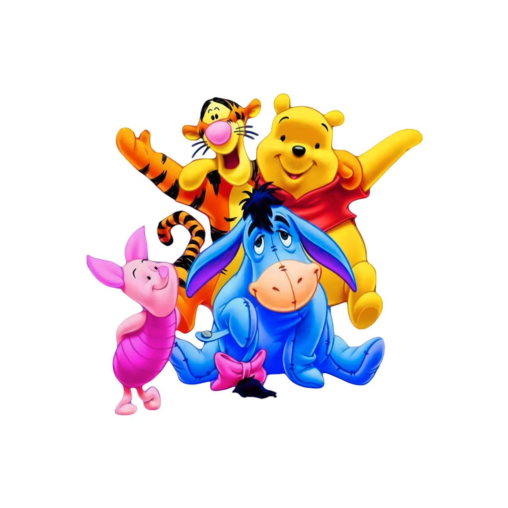

# zohal (زحل)

**Live demo:** https://soroush83faraz.github.io/zohal/ — in the web demo, data lives in memory for the session; the JSON-file persistence described below applies to native builds.

A Flutter app for running the front desk of a kids' indoor playhouse — a "playhouse management system" (سیستم مدیریت خانه بازی) with a Persian, right-to-left UI.

Staff check a child in with their name, age, contact number and the amount of play time reserved; the app then shows every child currently playing as an animated card with a live countdown. Each card has a progress bar that turns red when fewer than 5 minutes remain, so staff can see at a glance whose session is about to end.

## Features

- **Session cards** — one card per child with name, contact number and a minute-by-minute progress bar of remaining time; hover/glow and scale animations (`GlowCard`), tap for a detail page (age, reserved / remaining / elapsed minutes)
- **Add / edit / delete** children, with a confirmation dialog before deleting
- **Live countdown** — a periodic timer recomputes remaining time from the reservation timestamp every minute and autosaves
- **Persistence** — the list is serialized to JSON in the app documents directory (`path_provider`), so state survives restarts
- **Dark / light theme** — toggle from the app bar, animated transitions, state via `provider`
- **Persian RTL interface** with a Winnie-the-Pooh themed background

Background artwork used in the app:



## Stack

- Flutter (Dart SDK ^3.5.3), Material
- `provider` for theme state, `path_provider` for local JSON storage
- Plain model/view/controller split: `lib/models/` (the `Child` model), `lib/View/` (home, add, edit, detail), `lib/controllers/` (list, add/edit, save/load, card widget)

## Running

The repo tracks only the Dart/Flutter sources (platform folders are gitignored), so regenerate them first:

```bash
flutter create .
flutter pub get
flutter run
```

## Credits

Group project built with [Mohammad Amin (Amin4424)](https://github.com/Amin4424). My contributions: card UI and animations, background, theming.

Originally developed at [Amin4424/zohal](https://github.com/Amin4424/zohal).
